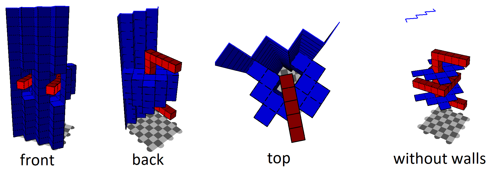

The code in this repository can simulate a surface code patch encountering erasure errors,
and then combine the physical stabilizer and data qubit measurements in order to recover
the logical qubit value at the end (despite the erasures). 

